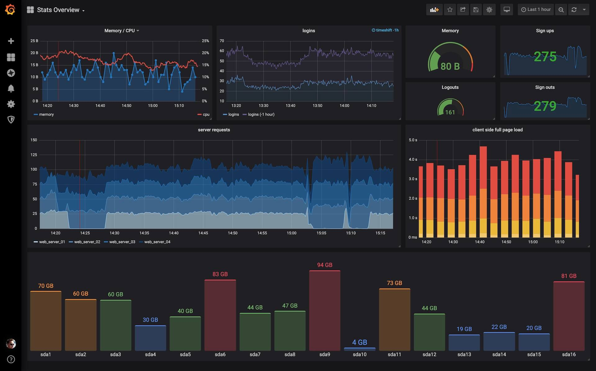

# Monitoring with Grafana, Loki and Prometheus

Prerequisite

    Basic Knowlege of Node.js and Express Framework
    Basic to Intermediate knowledge in Docker and Containerization - Learn Docker Containerization
    
Installation and Setup

    1. Prometheus Server
        Create a prometheus-config.yml file and copy the following configration. Don't forget to replace <NDOEJS_SERVER_ADDRESS> with actual value.

        Code :

        global:
        scrape_interval: 4s

        scrape_configs:
            - job_name: prometheus
        static_configs:
            - targets: ["<NDOEJS_SERVER_ADDRESS>"]

    Start the Prometheus Server using docker compose
    version: "3"

    services:
        prom-server:
        image: prom/prometheus
        ports:
            - 9090:9090
        volumes:
            - ./prometheus.yml:/etc/prometheus/prometheus.yml

    Great, The prometheus server is now up and running at PORT 9090

2. Setup Grafana
    docker run -d -p 3000:3000 --name=grafana grafana/grafana-oss
    
    

3. Setup Loki Server
    docker run -d --name=loki -p 3100:3100 grafana/loki

# For AWS Configuration Steps

Video:
https://youtu.be/QwGm5m4AxNA

Install Grafana on Debian or Ubuntu

sudo apt-get install -y apt-transport-https
sudo apt-get install -y software-properties-common wget
sudo wget -q -O /usr/share/keyrings/grafana.key https://apt.grafana.com/gpg.key

Stable release
echo "deb [signed-by=/usr/share/keyrings/grafana.key] https://apt.grafana.com stable main" | sudo tee -a /etc/apt/sources.list.d/grafana.list
Beta release
echo "deb [signed-by=/usr/share/keyrings/grafana.key] https://apt.grafana.com beta main" | sudo tee -a /etc/apt/sources.list.d/grafana.list
# Update the list of available packages
sudo apt-get update

# Install the latest OSS release:
sudo apt-get install grafana
#To start Grafana Server
sudo /bin/systemctl status grafana-server

Install Loki and Promtail using Docker

Download Loki Config

wget https://raw.githubusercontent.com/grafana/loki/v2.8.0/cmd/loki/loki-local-config.yaml -O loki-config.yaml

Run Loki Docker container

docker run -d --name loki -v $(pwd):/mnt/config -p 3100:3100 grafana/loki:2.8.0 --config.file=/mnt/config/loki-config.yaml

Download Promtail Config

wget https://raw.githubusercontent.com/grafana/loki/v2.8.0/clients/cmd/promtail/promtail-docker-config.yaml -O promtail-config.yaml

Run Promtail Docker container

docker run -d --name promtail -v $(pwd):/mnt/config -v /var/log:/var/log --link loki grafana/promtail:2.8.0 --config.file=/mnt/config/promtail-config.yaml

Install Prometheus and cAdvisor

cAdvisor (short for container Advisor) analyzes and exposes resource usage and performance data from running containers. cAdvisor exposes Prometheus metrics out of the box.

Download the prometheus config file

wget https://raw.githubusercontent.com/prometheus/prometheus/main/documentation/examples/prometheus.yml

Install Prometheus using Docker

docker run -d --name=prometheus -p 9090:9090 -v <PATH_TO_prometheus.yml_FILE>:/etc/prometheus/prometheus.yml prom/prometheus --config.file=/etc/prometheus/prometheus.yml

Add cAdvisor target

scrape_configs:
- job_name: cadvisor
  scrape_interval: 5s
  static_configs:
  - targets:
    - cadvisor:8080

#Using Docker Compose

version: '3.2'
services:
  prometheus:
    image: prom/prometheus:latest
    container_name: prometheus
    ports:
    - 9090:9090
    command:
    - --config.file=/etc/prometheus/prometheus.yml
    volumes:
    - ./prometheus.yml:/etc/prometheus/prometheus.yml:ro
    depends_on:
    - cadvisor
  cadvisor:
    image: gcr.io/cadvisor/cadvisor:latest
    container_name: cadvisor
    ports:
    - 8080:8080
    volumes:
    - /:/rootfs:ro
    - /var/run:/var/run:rw
    - /sys:/sys:ro
    - /var/lib/docker/:/var/lib/docker:ro
    depends_on:
    - redis
  redis:
    image: redis:latest
    container_name: redis
    ports:
    - 6379:6379

#  Verify

docker-compose up -d
docker-compose ps

Test PromQL
rate(container_cpu_usage_seconds_total{name="redis"}[1m])
container_memory_usage_bytes{name="redis"}
